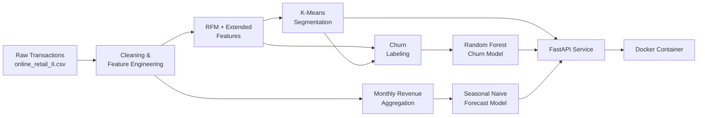

# Customer Intelligence Platform

An end-to-end machine learning platform for retail customer analytics — combining **K-Means customer segmentation**, **churn prediction**, and **revenue forecasting** into a single production-style service, built with **FastAPI** and containerized with **Docker**.

This isn't three separate models bolted together — it's one coherent pipeline: raw transaction data flows through cleaning and feature engineering, splits into three modeling tasks that each inform the others, and lands in a served API that a real business could actually query.

---

## Table of Contents

- [Overview](#overview)
- [Dataset](#dataset)
- [Tech Stack](#tech-stack)
- [Project Architecture](#project-architecture)
- [Methodology](#methodology)
- [Key Technical Decisions & Challenges](#key-technical-decisions--challenges)
- [API Reference](#api-reference)
- [Getting Started](#getting-started)
- [Results Summary](#results-summary)
- [Future Improvements](#future-improvements)

---

## Overview

Retail businesses sit on a mountain of raw transaction logs but often lack a unified view of *who their customers are*, *who's about to leave*, and *what revenue to expect next*. This project builds that unified view for a UK-based online retailer, answering three questions with three different ML approaches:

| Question | Approach | Output |
|---|---|---|
| Who are our customers, behaviorally? | K-Means clustering on RFM + engineered features | 4 named customer segments |
| Which customers are about to churn? | Random Forest (vs. Logistic Regression baseline) | Per-customer churn probability |
| What will next month's revenue look like? | Seasonal Naive forecasting | Monthly revenue forecast |

All three are served live through a FastAPI service, containerized with Docker for consistent deployment anywhere.

## Dataset

**[Online Retail II](https://archive.ics.uci.edu/dataset/502/online+retail+ii)** (UCI Machine Learning Repository)

- ~1,067,371 raw transaction rows
- UK-based online retailer, selling mostly unique all-occasion gift-ware
- Spans **2009-12-01 to 2011-12-09** (~2 years)
- After cleaning (removing cancellations, missing customer IDs, and invalid quantity/price rows): **805,549 transactions across 5,878 unique customers**

## Tech Stack

`Python` · `pandas` · `NumPy` · `scikit-learn` · `statsmodels` · `matplotlib` / `seaborn` · `FastAPI` · `Pydantic` · `Docker` · `Jupyter`

## Project Architecture



```
customer-intelligence-platform/
│
├── data/
│   ├── raw/                  # online_retail_II.csv
│   └── processed/            # cleaned & engineered datasets (gitignored)
│
├── notebooks/
│   ├── 01_eda.ipynb
│   ├── 02_feature_engineering.ipynb
│   ├── 03_kmeans_segmentation.ipynb
│   ├── 04_churn_labeling.ipynb
│   ├── 05_churn_modeling.ipynb
│   └── 06_revenue_forecasting.ipynb
│
├── src/
│   ├── __init__.py
│   └── feature_engineering.py   # shared transform logic (notebooks + API)
│
├── models/                   # trained artifacts (gitignored)
│   ├── scaler.pkl
│   ├── kmeans_model.pkl
│   ├── churn_model.pkl
│   └── forecast_model.pkl
│
├── app/                       # FastAPI service
│   ├── main.py                # routes
│   ├── schemas.py             # Pydantic request/response models
│   └── utils.py                # model loading + prediction logic
│
├── images/                    # charts generated by the notebooks
│
├── Dockerfile
├── .dockerignore
├── requirements.txt
└── README.md
```

## Methodology

### Module 1 — Exploratory Data Analysis
Investigated data quality before touching anything: **22.8%** of rows had no `Customer ID` (guest checkouts), **19,494** invoices were cancellations (prefixed `'C'`), and both `Quantity` and `Price` had invalid negative/zero values. These findings directly shaped every cleaning decision downstream.

### Module 2 — Feature Engineering
Built the customer-level feature table from transaction-level data:
- **Core RFM:** Recency, Frequency, Monetary
- **Extended features:** Tenure, Average Order Value (AOV), Purchase Variability (std. dev. of days between orders), Product Diversity (unique products purchased)
- Log-transformed the heavily right-skewed features (`Frequency`, `Monetary`, `AOV`, `Purchase_Variability`, `Product_Diversity`) and scaled everything with `StandardScaler`

### Module 3 — Customer Segmentation (K-Means)
Chose **k=4** via elbow + silhouette analysis, balancing statistical separation (silhouette technically peaks at k=2) against business actionability. Validated cluster separation with PCA (**78% variance explained in 2D**).

| Segment | Customers | Profile |
|---|---|---|
| **Loyal High-Value Customers** | 1,341 | Most recent (~46 days), most frequent (~18 orders), highest spend (~$10,199), longest tenure (~591 days) |
| **At-Risk Regulars** | 1,829 | Long tenure (~353 days) but highly irregular purchase timing (variability ~88) and rising recency |
| **New / Occasional Big-Ticket Buyers** | 1,437 | Short tenure (~92 days), few orders, but notably high order value (~$580) |
| **Lost / Churned Customers** | 1,271 | Longest recency (~432 days — over a year inactive), lowest across every other metric |

### Module 4 — Churn Labeling
Defined churn as `Recency > 180 days`, a threshold derived from the actual inter-purchase gap distribution (median ~24 days, 75th percentile ~61 days) rather than picked arbitrarily — and cross-validated against the K-Means segments (Lost/Churned: 85% churned; Loyal High-Value: 5% churned).

### Module 5 — Churn Prediction
Compared Logistic Regression against Random Forest, both with `class_weight='balanced'` for the ~41/59 class imbalance:

| Model | Precision | Recall | F1 | ROC-AUC |
|---|---|---|---|---|
| Logistic Regression | 0.61 | 0.75 | 0.68 | 0.81 |
| **Random Forest (chosen)** | **0.72** | 0.69 | **0.71** | **0.85** |

Logistic Regression caught slightly more churners, but at nearly double the false-alarm rate. **Top churn drivers:** `Tenure` and `Monetary` — consistent with the segmentation story.

### Module 6 — Revenue Forecasting
| Model | MAPE |
|---|---|
| Naive baseline (flat) | 38.21% |
| **Seasonal Naive (chosen)** | **4.63%** |

Standard seasonal models (Holt-Winters, SARIMA) require at least 2 full seasonal cycles of training data — this dataset only offers 2 years total, leaving too little after a train/test split. Seasonal Naive (this month = same month last year) turned that constraint into a simple, well-validated solution.

### Module 7 — FastAPI Service
Three prediction endpoints (`/segment`, `/churn-score`, `/forecast`) plus health checks, all tested end-to-end against the real trained models — verified to reproduce the exact predictions seen in the notebooks.

### Module 8 — Dockerization
Containerized the API with a layer-cached `Dockerfile` (dependencies installed before code is copied, so rebuilds are fast), tested against the same endpoint checks as the local run.

## Key Technical Decisions & Challenges

A few things worth highlighting beyond "the models ran":

- **A silent bug in the K-Means pipeline:** `Customer ID` was initially included in the feature set passed to `KMeans.fit()`. Since it's an arbitrary large number, it dominated every distance calculation — WCSS values were inflated by orders of magnitude, and clusters barely differed from each other. Excluding it produced dramatically more meaningful, well-separated segments.
- **Data leakage in churn modeling:** since `Churned` is defined directly from `Recency`, `Recency` was deliberately excluded from the churn model's feature set — otherwise the model would trivially re-learn the threshold instead of finding real predictive signal.
- **SARIMA was tried, not just skipped:** fitting `SARIMA(1,1,1)(1,1,1,52)` on the weekly data produced a silent `statsmodels` warning that seasonal parameters couldn't be estimated with too few observations and were zeroed out — a good example of a model *appearing* to work while quietly not doing what it claims.
- **Monthly vs. weekly forecasting granularity:** weekly data (more data points) was tested as an alternative, using a Fourier-term regression to handle the long seasonal period. It worked, but monthly granularity with Seasonal Naive was simpler to justify and performed excellently (4.63% MAPE), so it was kept as the final approach.

## API Reference

| Method | Endpoint | Description |
|---|---|---|
| GET | `/health` | Service health check |
| POST | `/segment` | Predict a customer's K-Means segment |
| POST | `/churn-score` | Predict churn probability |
| POST | `/forecast` | Forecast revenue for a target month |

**Example — `/segment`:**
```json
POST /segment
{
  "Recency": 46, "Frequency": 18, "Monetary": 10198.64,
  "Tenure": 591, "AOV": 545.27, "Purchase_Variability": 50.07, "Product_Diversity": 209
}
```
```json
{ "cluster": 1, "segment_name": "Loyal High-Value Customers" }
```

**Example — `/forecast`:**
```json
POST /forecast
{ "year": 2012, "month": 11 }
```
```json
{ "target_month": "2012-11", "predicted_revenue": 1161817.38, "method": "seasonal_naive (same month, previous year)" }
```

Full interactive documentation is available at `/docs` (Swagger UI) once the service is running.

## Getting Started

### Run locally
```bash
pip install -r requirements.txt
uvicorn app.main:app --reload
```
Visit `http://127.0.0.1:8000/docs`

### Run with Docker
```bash
docker build -t customer-intelligence-platform .
docker run -p 8000:8000 customer-intelligence-platform
```
Visit `http://localhost:8000/docs`

## Results Summary

| Task | Metric | Result |
|---|---|---|
| Segmentation | Silhouette Score (k=4) | 0.26 |
| Segmentation | PCA variance explained | 78% |
| Churn Prediction | F1 / ROC-AUC (Random Forest) | 0.71 / 0.85 |
| Revenue Forecasting | MAPE (Seasonal Naive) | 4.63% |

## Future Improvements

- Add holiday/closure-aware features to the forecasting model (the current approach doesn't know about the Christmas shutdown week)
- Revisit forecasting once more than 2 years of history are available, enabling a full seasonal SARIMA/Holt-Winters model
- Deploy the Docker image to a cloud service (AWS/Render/Railway) for a live public demo
- Add authentication and request logging to the API for a more production-realistic setup

---

**Author:** Shreyas — B.Tech ECE, REVA University | AI & Data Science, iHub IIT Roorkee
